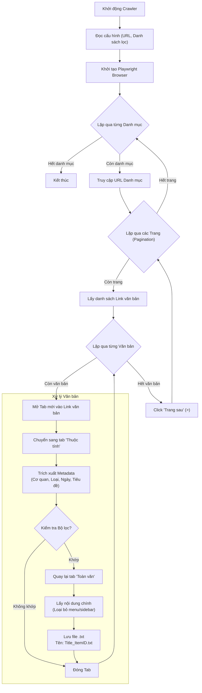

# Quy trình hoạt động của VBPL Crawler

Dưới đây là mô tả chi tiết về luồng hoạt động (workflow) của tool crawl dữ liệu từ trang **vbpl.vn/boquocphong**.

## Sơ đồ luồng (Flowchart)

## Chi tiết các bước

### 1. Khởi tạo (Initialization)
*   Tool đọc file `config.py` để lấy danh sách các URL cần crawl (Văn bản QPPL, Văn bản hợp nhất...) và danh sách các Cơ quan/Loại văn bản cần lọc.
*   Khởi động trình duyệt ảo (Playwright Chromium).

### 2. Duyệt Danh mục (Category Navigation)
*   Tool truy cập lần lượt vào các trang danh mục đã định nghĩa.
*   Nếu là trang tìm kiếm, nó sẽ tự động nhấn nút "Tìm kiếm" để hiện danh sách.

### 3. Phân trang (Pagination Loop)
*   Tại mỗi trang danh sách, tool tìm tất cả các đường link dẫn đến chi tiết văn bản (dựa trên `ItemID` trong URL).
*   Sau khi xử lý hết các văn bản ở trang hiện tại, tool tìm nút **">" (Trang sau)**. Nếu thấy nút này, nó click để sang trang tiếp theo và lặp lại quy trình. Nếu không, nó chuyển sang danh mục khác.

### 4. Xử lý Văn bản (Document Processing)
Đây là phần quan trọng nhất để đảm bảo dữ liệu sạch và đúng:

*   **Bước 4.1: Mở văn bản**: Mở văn bản trong một tab mới để giữ nguyên trang danh sách gốc.
*   **Bước 4.2: Lấy Metadata (Tab Thuộc tính)**:
    *   Tool click vào tab **"Thuộc tính"**.
    *   Trích xuất các thông tin: *Cơ quan ban hành*, *Loại văn bản*, *Ngày ban hành*.
    *   Lấy **Tiêu đề** văn bản (thường nằm đậm ở trên bảng thuộc tính).
*   **Bước 4.3: Lọc (Filtering)**:
    *   Kiểm tra xem *Cơ quan ban hành* và *Loại văn bản* có nằm trong danh sách yêu cầu không (trong `config.py`).
    *   Nếu không khớp, bỏ qua và đóng tab.
*   **Bước 4.4: Lấy Nội dung (Tab Toàn văn)**:
    *   Tool click quay lại tab **"Toàn văn"**.
    *   Tìm khung chứa nội dung chính (`#toanvancontent` hoặc `.box-content`).
    *   **Làm sạch**: Loại bỏ các đoạn text thừa như menu bên trái ("Văn bản quy phạm pháp luật", "Mục lục"...).

### 5. Lưu trữ (Saving)
*   Tạo đường dẫn thư mục theo cấu trúc: `crawled_data/[Cơ quan ban hành]/[Loại văn bản]/`.
*   Tạo tên file duy nhất: `[Tiêu đề]_[ItemID].txt`. Việc thêm `ItemID` đảm bảo không bao giờ bị ghi đè file nếu có 2 văn bản trùng tên.
*   Ghi nội dung và metadata vào file.
